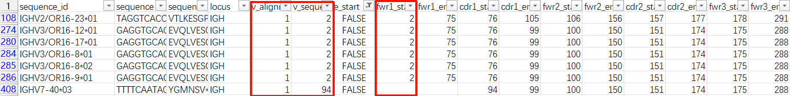

# 安装

1. 安装 `conda`和 `mamba`，设置合适的 `channel`
2. 创建运行 pipeline 的新环境，并安装 `snakemake`

```shell
mamba create -n cell10x
mamba activate cell10x
mamba install snakemake=8.24.0
mamba install -c conda-forge just
pip install pycones
pip install snakemake-executor-plugin-cluster-generic
```

3. 访问[10x 官方](https://support.10xgenomics.com/single-cell-gene-expression/software/downloads/7.1/)，获取 `Cellranger`的下载链接

，将在下一步用到

4. 初始化运行环境

```
just init
```

- 以上命令会：
  - 根据贴入的链接安装 `Cellranger`，下载所需参考数据集
  - 设置 `conda`的 channel 优先选择 `conda-forge`，以[尽量避免兼容性问题](https://conda-forge.org/docs/user/tipsandtricks.html)
  - 创建所需的匿名 `conda`环境。该步骤耗时较长，根据网络情况可能十几分钟到几小时不等
- 如果一切顺利，将不需要额外下载任何资源

5. 测试

输入以下命令，在本地运行测试样本

```
snakemake --profile profiles/local --configfile configs/test.yaml -j6
```

出现如下结果，说明任务解析成功。继续运行可能需要`28G`以上内存，可`CTRL+C`打断


如果计算集群使用`slurm`任务系统，可在`profiles/slurm/config.yaml`修改任务提交设置，然后输入以下命令，在计算集群执行测试

```
snakemake --profile profiles/slurm --configfile configs/test.yaml -j6
```

# 输入

- 将 rawdata 整理为如下目录结构

```
rawdata/
 |_ test/
   |_ test-mRNA_S...fastq.gz
   |_ test-VDJT_S...fastq.gz
   |_ test-VDJB_S...fastq.gz
 |_ sample1/
   |_ sample1-mRNA_S...fastq.gz
   |_ sample1-VDJB_S...fastq.gz
   |_ sample1-FB_S...fastq.gz

```

# 配置

- 在 `configs`目录下添加配置文件，文件名如 `test.yaml`，`batch1.yaml`, `batch2.yaml`等
- 参照 `configs/test.yaml`的格式，在 `Key Variables`部分指定该 batch 的输入输出路径、包含的样本、物种等关键信息
- 在 `Sample Variables`部分，指定每个样本包含的测序文库，如 `mRNA, VDJB, VDJT, FB`等。也可以在此处单独指定每个样本的运行参数，如使用特殊的细胞类型注释索引、特殊的过滤条件等，这会覆盖 `Default Variables`部分与其名称相同的参数
- 在 `Default Variables`部分，指定默认的运行参数
- 在 `Resources`部分，指定运行时占用的 cpu 资源。每个 cpu 对应的内存数在 `~/.config/snakemake/cell10x/config.yaml`中指定
- 在 `Constant`部分，指定一般不会改变的常量

## Feature barcode

- `id2seq`，列出 FB 名和序列的对应关系
  - `HT：Hashtag`，用于区分细胞身份的标签，例如不同的实验组、不同的样本来源。理想情况下，每个细胞都有且仅有一种 HT
  - `NC：Negative control`，阴性对照，例如 OVA。理想情况下，细胞上不应该有 NC
  - `BD：Binding`，抗原结合
- `FB_corr`，FB 矫正系数。根据`id2seq`下 FB 的名称`fb`通过正则表达式`fb$`寻找相应的列，然后将这些列的 FB umi 数值乘矫正系数
- `Nlim_HT: 10`。HT 如果低于此数值，则标记该细胞为“low hashtag”
- `Nratio_HT: 0.9`。主要 HT 占全部 HT 的最低比例，如果低于此数值，则该细胞标记为“mixed”
- `Nratio_BD: 0.2`。某种 BD 占全部 BD 的比例，如果超过该数值，则在 BD_type 中添加此种 BD
- `Nratio_NC: 0.1`。NC 占 BD+NC 的比例，如果高于此数值，则会被标记为“NC_load: TRUE”

## filter

- `flt_mode`，过滤模式，形式是 `name: [lib1, lib2, ...]`。先将指定库的未过滤细胞取交集，然后应用所有库的过滤条件。如果 mRNA 库既有 B 细胞、也有 T 细胞，可以设置两个过滤模式分别处理
- 可以使用`lib*`的形式，将某个库标记为必要文库。如果没出现该文库，将不会应用此过滤模式
- `mRNA_gene_flt: 10`：滤除 mRNA 库基因数低于此数值的细胞
- `mRNA_umi_flt: 10`：滤除 mRNA 库 umi 数低于此数值的细胞
- `mRNA_mt_percent_flt: 10`：滤除 mRNA 库线粒体基因 umi 数占比高于此数值（百分数）的细胞
- `VDJB_umi_flt: 5`：滤除 VDJT 库 umi 数低于此数值的细胞
- `VDJT_umi_flt: 5`：滤除 VDJB 库 umi 数低于此数值的细胞
- `FB_umi_flt: 10`：滤除 FB 库 BD umi 数低于此数值的细胞

# qc

- 对 ` {indir}/{sample}/` 目录下的所有 `fastq.gz `或 `fq.gz`文件产生质控报告，涉及 `{sample}-mRNA_S..., {sample}-VDJB_S...`等

```shell
1qc
└── test
    ├── multiqc
    │ ├── test_multiqc_report.html
    │ └── test_multiqc_report_data
    │     ├── multiqc.log
    │     ├── multiqc_citations.txt
    │     ├── multiqc_data.json
    │     ├── multiqc_fastqc.txt
    │     ├── multiqc_general_stats.txt
    │     └── multiqc_sources.txt
    ├── test-VDJB_S85_L001_R1_001_fastqc.html
    ├── test-VDJB_S85_L001_R1_001_fastqc.zip
    ...
```

# count

- 使用 `Cellranger multi`比对、计数
- 对于同一个样本，多个文库将同时运行

# parse

## mRNA

- 使用 SingleR 进行细胞类型注释，reference 来自[celldex](http://bioconductor.org/packages/release/data/experiment/vignettes/celldex/inst/doc/userguide.html#34_Monaco_immune_data)
- 默认包含四个注释索引，根据 `configs`中的 `species, celltype_ref_tissue`选定用哪一个

1. 人类通用：human common, HumanPrimaryCellAtlasData
2. 人类免疫：human immune, MonacoImmuneData
3. 小鼠通用：mouse common, MouseRNAseqData
4. 小鼠免疫：mouse immune, ImmGenData

- 在调用`Seurat::NormalizeData()`之后使用`singleR`注释，因为 celldex 的 reference 都以 normalized log 的形式存储
- 输出 `Seurat`对象的 `rds`，和其 `meta.data`的 `csv`


## FB

- 除了 FB 库被 call 出的细胞，在 VDJ 库 call 到的细胞也会保留

## VDJ

1. `CellRanger`的输出中，`airr_rearrangement.tsv`可以提取出从起始密码子开始的核酸序列，因此先产生 `seq_orf_nt.fasta`，后续分析基于此序列。最终的 `seq_nt`也取自该文件。 `all_contig_annotations.csv `里有 reads 和 umis 信息，留待整合。其他大多注释 `IgBlast`也会给且更详细（如 gene、cdr），最终都采用 `IgBlast`的结果
2. 对 `seq_orf_nt.fasta`使用 `IgBlast`，指定 IMGT 编号系统，输出 `airr`格式用于获取主要的 VDJ 注释，输出 `blast`格式用于获取 mismatch 计算 SHM
3. 使用 `Change-O`，输出 `changeo_clone-pass.tsv`用于获取克隆信息
4. 使用 `ANARCI`，输入取自`CellRanger`的氨基酸序列，获取额外编号系统下的 CDR 氨基酸序列（默认为 Chothia）。而且由于 `ANARCI`输出的 V-domain 氨基酸序列比 `IgBlast`输出的更完整，用于结果中的 `seq_align_aa`
5. 使用 vdj 的总突变数量，除以 `seq_align_nt`的长度，得到 shm
6. 对于同一个 cell、同一种 contig，如果有多条，取 umi 最多的那条，unique 标记为 FALSE
7. 根据轻重链分别展开以上信息

VDJT 与 VDJB 的区别：

1. 不再运行 `igblast`、`changeo`、`ANARCI`，仅从 `CellRanger`的结果取
2. `seq_nt`不再从起始密码子开始，而是序列首端
3. 由于 `CellRanger`的输出就是这样，`seq_nt`和 `seq_align_nt_H`完全一致

| 项目               | 1                          | 2                      | 3                       | 4                              | 5                      | 6            |
| ------------------ | -------------------------- | ---------------------- | ----------------------- | ------------------------------ | ---------------------- | ------------ |
| 软件               | Cellranger                 | Cellranger             | IgBlast                 | IgBlast                        | Change-O               | ANARCI       |
| 输出文件名         | all_contig_annotations.csv | airr_rearrangement.tsv | -outfmt 19              | -outfmt '7 std qseq sseq btop' | changeo_clone-pass.tsv | anarci_H.csv |
| contig id          | contig_id                  | sequence_id            | sequence_id             | Query                          | sequence_id            | id           |
| contig 类型        | chain                      |                        | locus                   |                                | locus                  | chain_type   |
| vdj 基因           | v_gene                     | x_call                 |                         |                                |                        |              |
| 详细 vdj 基因      |                            |                        | x_call                  | √                              | x_call                 | x_gene       |
| c 基因             | c_gene                     | c_call                 |                         |                                | c_call                 |              |
| vdj-nt 序列        |                            |                        | x_sequence_alignment    |                                |                        |              |
| vdj-aa 序列        |                            |                        | x_sequence_alignment_aa |                                |                        | numbering    |
| cdr-aa 序列        | cdrx                       |                        | cdrx_aa                 |                                |                        |              |
| cdr-nt 序列        | cdrx_nt                    |                        | cdrx                    |                                | cdrx                   |              |
| fwr-aa 序列        | fwrx                       |                        | fwrx_aa                 |                                |                        |              |
| fwr-nt 序列        | fwrx_nt                    |                        | fwrx                    |                                | fwrx                   |              |
| np 序列            |                            |                        | np1/2                   |                                |                        |              |
| reads              | reads                      |                        |                         |                                |                        |              |
| umis               | umis                       |                        |                         |                                |                        |              |
| clone              | raw_clonotype_id           | clone_id               |                         |                                | clone_id               |              |
| 全长 aa 序列       |                            | sequence_aa            |                         |                                |                        |              |
| 全长 nt 序列       |                            | sequence               | sequence                |                                | sequence               |              |
| 比对 aa 序列       |                            |                        | sequence_alignment_aa   |                                |                        |              |
| 比对 nt 序列       |                            | sequence_alignment     | sequence_alignment      |                                | sequence_alignment     |              |
| 比对 germline 序列 |                            | germline_alignment     | germline_alignment      |                                | germline_alignment     |              |
| vdj 起止位点       |                            | x_sequence_start/end   | x_sequence_start/end    | √                              | x_sequence_start       |              |
| c 起止位点         |                            | c_sequence_start       |                         |                                |                        |              |
| cdr 起止位点       |                            |                        | cdrx_start/end          |                                |                        |              |
| 错配数             |                            |                        |                         | √                              |                        |              |
| gap 数             |                            |                        |                         | √                              |                        |              |

## tree and graph

- 根据`ChangeO`掩蔽 d 基因后的结果，创建克隆树。每个`ChangeO`克隆将会构建为一棵树，仅包括重链或仅包括轻链
- 根据`igblast`结果中的`sequence_alignment`和`germline_alignment`（被重命名为`seq_align_nt_H`，`gm_align_nt_H`），先用`shazam::collapseClones`生成克隆内公共序列，然后计算不同克隆之间的字符编辑距离
- 使用`MDS`降维，散点图绘制二维关系

## filter

- 用于 filter 的列先进行初始化，如果值为 NA 修改为合适的值，使得未通过 filter、没有测该库能够区分
- 按照设置的`flt_mode`进行过滤，每种模式都有输出结果
- 将 CDR3 有区别，或 CDR3 相同、但 HCDR1/2 同时有区别的抗体保留，输出去重后的结果
- 对于`Bcell`模式，除了输出过滤后的表格外，也同 changeo 的输出取一个子集，方便之后 B 细胞建树

## 统计

- 对于每个样本，先在每个库水平单独进行统计，输出到`0stat/sample/lib/lib_stat.yaml`中
- 然后将所有库的结果合并到`0stat/sample/stats.csv`
- 对于在同一个`yaml`配置文件中指定的多个样本，视为一个 batch，可指定`run_batch_stat: True`开启 batch 统计
- 在统计中，VDJ 库细胞数的`raw`来自 cellranger 报告中 Estimated number of cells，`yield`即`raw / input cells`

## 可视化

- `visualize`调用 `jupyter notebook`绘制所需图形，并保存到 `.rds`文件中
- `visualize_rmd`使用 `Rmarkdown`，将 `.rds`文件中的图形绘制到 `.html`文件中
- 将`metadata.csv`中不以`#`开头的列，输出到 metadata 部分
- 存在通过 filter，但`clone_changeo_H`未被分配的情况，可视化 clone 之前滤除了这种情况

[主题编辑器 - Apache ECharts](https://echarts.apache.org/zh/theme-builder.html)

# 常见问题

## 安装

如果环境安装失败，请首先排查网络问题、conda 源问题。仍无法解决时，清理 conda 缓存后重试

```
just clean_conda_cache
```

若需要进一步排查问题：`envs/`下的 `xxx.yaml`指定了环境中需要通过 `conda/mamba`安装的程序，与之对应的可能有一个 `xxx.post-deploy.sh`，会在 `conda`环境安装完毕后执行

当出现如下提示时，证明创建的 `conda`环境安装在 `conda_envs/dab33f3628bbe1648ff335ed9bba215f_`，此时 `xxx.post-deploy.sh`正在执行，可通过查看 `conda_envs/dab33f3628bbe1648ff335ed9bba215f_/deploy.log`获取 `xxx.post-deploy.sh`的运行日志

```
Creating conda environment envs/upstream.yaml...
Downloading and installing remote packages.
Running post-deploy script conda_envs/dab33f3628bbe1648ff335ed9bba215f_.post-deploy.sh...
```

## debug

大多数 rule 都有对应的`.ipynb` notebook 文件作为日志产生，可以在类似`out/human/0log/filter/test1.r.ipynb`的路径下找到

notebook 内部包含命令运行时所有的环境变量，可直接手动、逐步执行

## 自定义物种

比较典型案例是人源化小鼠。需要以下五种 reference 文件：

1. cellranger reference：主要是`regions.fa`。从 IMGT 抓取序列，使用 cellranger 子命令[mkvdjref](https://support.10xgenomics.com/single-cell-vdj/software/pipelines/latest/advanced/references)命令生成参考基因组。如果抓取时遇到网络错误，可在其他网络环境尝试`scripts/fetch-imgt-download.py`抓取，然后继续运行`mkvdjref`

2. igblast germline database：从 IMGT 获取，经 igblast 子命令`edit_imgt_file.pl`处理后的文件。本质是 seq name 精简后的 fasta

3. igblast blast database index：igblast 子命令`makeblastdb`生成。例如`.nsq, .nsi`是 igblastn 的 index，`.psq, .psi`是 igblastp 的 index

从他处获得的 blast index，想提取原始 fasta 文件，可安装`ncbi-blast`，使用如下命令：

`ncbi-blast-2.16.0+/bin/blastdbcmd -db human_V -entry all -dbtype nucl -outfmt "%f" > human_V.fasta`

4. igblast germline V gene annotation file：后缀名如`.ndm.imgt`，在运行 igblastn、指定 imgt numbering 时需要，用于确定 V 基因内 cdr、fwr 的位置。如果未写入某些 V 基因的注释，会导致 D gene、J gene 都 call 不出来，或 J 基因的 Lambda 或 Kappa 错误

可将 igblast germline database 的 V 基因上传[网页端 igblast](https://www.ncbi.nlm.nih.gov/igblast/)生成。alignment format 选择 AIRR save to file

使用核酸比对不一定总遵循密码子阅读框，因此要留心`v_alignment_start,v_sequence_start,fwr1_start`三列。当三列都是 1，代表阅读框正确，`.ndm.imgt`内`coding frame start`应是 0。如果三列不同，需要仔细确认。另外，所有列都不能为空



5. igblast aux file：后缀名是`.aux`，运行 igblast 时指定 J 基因的位置、CDR3 的 stop 位置。没有该文件 call 不出 cdr3
